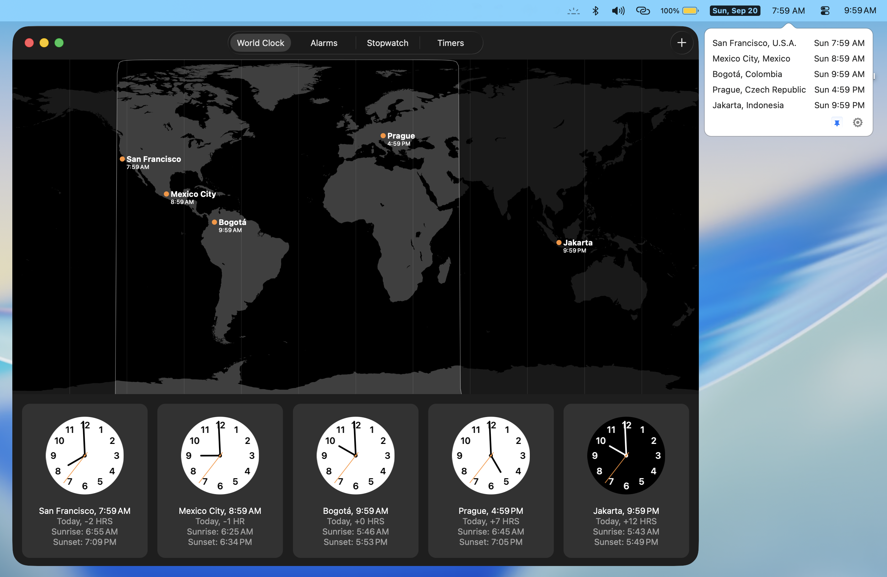

# Itsyclock

A tiny macOS menu bar app that shows the time in multiple time zones.

Itsyclock is a fork of [Itsycal](https://github.com/sfsam/itsycal) that trades
the calendar for world clocks. It puts the time in your *first* configured time
zone into the menu bar, giving you a second clock alongside the system one — so
you can keep an eye on the office, a teammate or family somewhere else without
doing the math. Click it and a small window drops down listing every time zone
you've configured, sorted by time of day, so it's easy to see who is ahead of
you and who is behind.



## Features

- **Reads your Clock.app world clocks.** On first launch, Itsyclock mirrors the
  cities you've already set up in Apple's Clock.app, including their labels.
- **A second clock in the menu bar.** The status item shows the time in the
  first time zone on your list, in 12-hour AM/PM format — your system clock
  stays put and keeps showing local time.
- **Sorted by actual time.** Rows are ordered by the real date and time in each
  zone, so zones on a different calendar day sort correctly.
- **Day of week per row.** Each row shows the weekday alongside the time
  (`Sun 4:59 PM`), which makes date rollovers obvious at a glance.
- **Pin it open.** Click the pin button to keep the window on screen instead of
  dismissing it when it loses focus.
- **Quick links.** The gear menu opens Clock.app or the Date & Time settings
  pane.
- **Light and dark.** Follows the system appearance, and keeps updating when the
  system clock or system time zone changes.

## Requirements

- macOS 11 (Big Sur) or later
- Xcode (to build from source)

## Installing

There are no prebuilt releases in this repo — build it yourself (below) and drag
`Itsyclock.app` into `/Applications`.

Itsyclock checks that it is running from `/Applications` and will ask you to move
it if it isn't. This is deliberate: it turns off Gatekeeper path randomization so
Sparkle updates can work. Debug builds skip the check.

## Building

Open `Itsyclock.xcodeproj` in Xcode and build the `Itsyclock` scheme. The two
dependencies, [Sparkle](https://sparkle-project.org) (updates) and
[MASShortcut](https://github.com/shpakovski/MASShortcut) (global hotkey), are
vendored as prebuilt frameworks in `Itsyclock/_frameworks/`, so there is nothing
to install first.

For the release/notarization flow, see [BUILD.md](BUILD.md).

## Configuration

Itsyclock has no preferences window yet. Settings live in `NSUserDefaults` under
the bundle identifier `com.mowglii.ItyclockApp`:

| Key | Type | Description |
| --- | --- | --- |
| `TimeZoneList` | array of strings | Time zone IDs to display, e.g. `America/Los_Angeles`. The **first** entry is the one shown in the menu bar; the drop-down rows are sorted by time, not by this order. Seeded from Clock.app on first launch. |
| `ShowSecondsInClock` | bool | Show seconds and tick once a second instead of once a minute. Default `NO`. |
| `Use24HourClock` | bool | Registered but not currently honored — times are always 12-hour AM/PM. |
| `PinItsycal` | bool | Whether the window stays open. Toggled by the pin button. |
| `SizePreference` | int | Text size: `0` small, `1` medium (default), `2` large. |
| `ThemePreference` | int | Appearance: `0` system (default), `1` light, `2` dark. |

For example, to pick your own time zones:

```sh
defaults write com.mowglii.ItyclockApp TimeZoneList -array \
    "America/Los_Angeles" "America/New_York" "Europe/Prague" "Asia/Jakarta"
```

Then quit and relaunch Itsyclock. Editing your world clocks in Clock.app and
deleting `TimeZoneList` works too — Itsyclock re-seeds itself from Clock.app when
the list is empty.

## Source layout

| Path | What's in it |
| --- | --- |
| `Itsyclock/AppDelegate.m` | Launch, defaults registration, migrations from older versions |
| `Itsyclock/ClocksViewController.m` | Status item, the clock list, Clock.app import, formatting |
| `Itsyclock/ItsyclockWindow.m` | The borderless drop-down window and its positioning |
| `Itsyclock/Themer.m`, `Sizer.m` | Appearance and text-size preferences |
| `Itsyclock/Mo*.{h,m}` | Small AppKit helpers (buttons, utilities) |
| `make_zips_and_appcast.sh` | Packages a notarized build and generates the Sparkle appcast |

I've learned a lot by looking at other people's code, so maybe someone can learn
something from looking at mine.

## Credits

Itsyclock is a fork of [Itsycal](https://github.com/sfsam/itsycal) by Sanjay
Madan ([mowglii.com/itsycal](https://mowglii.com/itsycal)), with the calendar and
agenda replaced by world clocks. Most of the app — the menu bar plumbing, the
drop-down window, the theming and sizing code, the AppKit helpers — is Itsycal's,
and the git history here starts from it.

## License

MIT — see [LICENSE.txt](LICENSE.txt).
